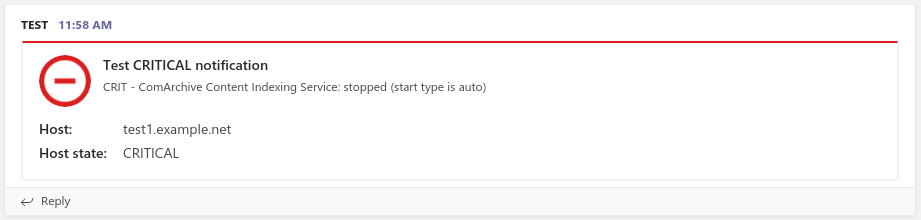
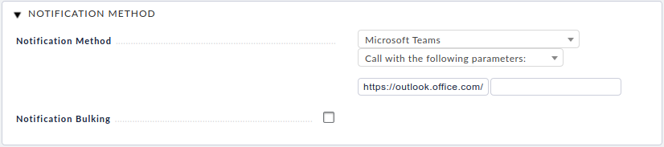

# checkmk-notify-teams

If you are using CheckMK and Microsoft Teams, this plugin can be used to send notifications to a teams webhook.

The plugin utilizes params in UI to set the webhook url.

## setup

- Install teams.py as `/omd/sites/{your_site}/local/share/check_mk/notifications/teams`
- ensure it's executable (`chmod +x teams`)
- setup notification. method = 'Microsoft Teams', param = webhook url

## Credits

CheckMK Team -- this is a modified version of their slack webhook plugin
RileyMichael -- this plugin is based on his work (https://github.com/RileyMichael)
